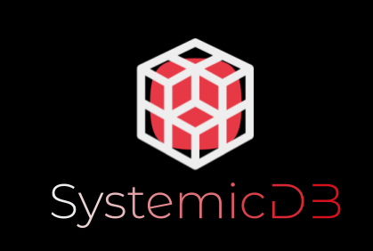

# SystemicDB - Core

This is the core SystemicDB package that is used in the full SystemicDB Server application. I can be imported and used in any Go application for standalone usage or one could wrap their own server around package for custom usage.

### Install

``go get github.com/SamuelBanksTech/SystemicDB-Core``

