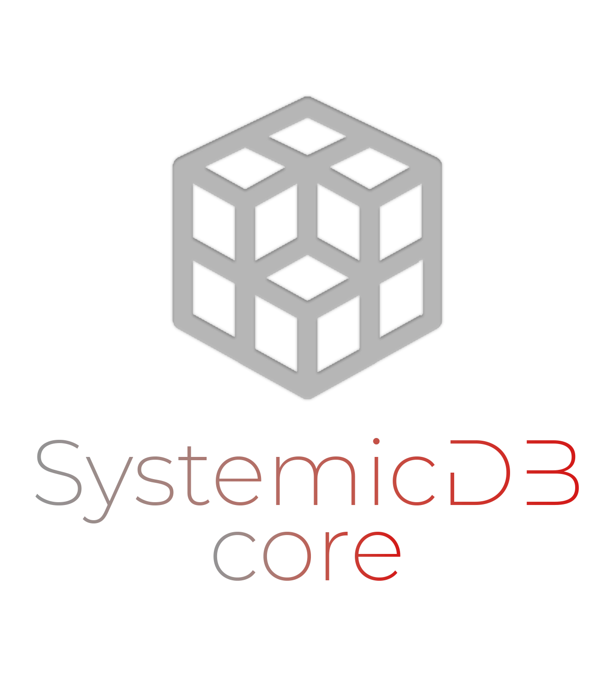

<div align="center" style="background: black">


[](http://golang.org)
[](https://goreportcard.com/report/github.com/SamuelBanksTech/SystemicDB-Core)
[](https://twitter.com/samuelbankstech)

</div>


# SystemicDB - Core

### Introduction

This is the core SystemicDB package that is used in the full SystemicDB Server application. I can be imported and used in any Go application for standalone usage or one could wrap their own server around package for custom usage.

### Install

```bash 
go get github.com/SamuelBanksTech/SystemicDB-Core
```

### Usage

First of all you will need to instantiate the core SystemicDB struct.

```go
sdb := NewSystemicDB()
```

Insert: Takes a string key, a byte slice as its data, and a expiry time  
This function will initiate a database optimisation function (AVL Tree Balancing)

```go
sdb.Insert("my-key", []byte("This is my byte data"), 15 * time.Minute)
```

Exists: Simply returns a bool value to denote whether that key exists or not 

```go
sdb.Exists("my-key")
```

Get: Take a key as a string and retrieves a struct containing the nodes data

```go
sdb.Get("my-key")

//Returns...
type NodeData struct {
    Key    string
    Value  []byte
    Expiry int64 //This is a unix timestamp of the exact time it will expire and bew removed from the database
}
```

Remove: Takes a key as a string, removes the node and all the associated data  
This function will initiate a database optimisation function (AVL Tree Balancing)

```go
sdb.Remove("my-key")
```

### TODO

- ❇️ Implement a tag map to allow grouping of keys
  - Implement batch operations by tag (Remove By Tag for example)
- ❇️ Produce benchmarks comparison tables (although I already know it's faster than most)
- ❇️ Implement some overrides in struct init that will allow custom timings for Garbage Collection etc